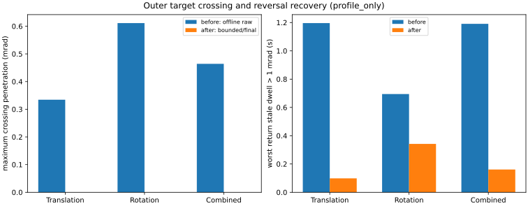
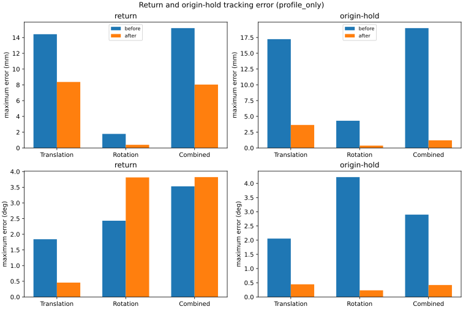

# Outer target-crossing clamp 실물 Follow 전후 분석

분석일: 2026-08-28 (Asia/Seoul)

> **역사적 분석:** 이 문서는 `af09a97` outer clamp가 active였을 때 작은
> Translation·Rotation·Combined profile에서 얻은 결과를 보존한다. 이후 수동
> 장거리 Pose Follow에서 target-hold로 진행이 정지하는 회귀가 확인되어 clamp는
> revert됐다. 현재 production controller 동작을 설명하지 않으며, clamp가 줄였던
> 누적 overshoot는 다시 미해결 상태다.

## 결론

결론 분류는 **2. 일부 프로필만 개선됨**이다. 변경 후에는 세 프로필 모두에서
bounded command의 target-crossing penetration이 수치 오차 범위에서 0이었고,
return의 stale IK-command offset, origin-hold의 위치·자세 final error, TCP 위치
오차가 대체로 줄었다. 새 IK 실패나 joint limiter 증가는 없었다.

다만 Rotation과 Combined의 moving 구간 자세 mean/RMS가 각각
1.337/1.732 deg에서 2.097/2.686 deg, 1.695/1.949 deg에서
2.166/2.671 deg로 악화됐다. clamp event의 92.0--95.3%가 target-hold였고 실행 간
편차도 남아 있으므로 세 프로필에서 일관된 종합 개선이라고 결론 내리지 않는다.

## 데이터 선택과 코드 계보

원본은 `/home/cbj4/openarm_follow_data`의 날짜별 폴더와 8개 압축파일을
재귀 확인했다. 압축은 임시 폴더에서만 풀었고 원본을 수정·이동·커밋하지 않았다.

주 비교에 사용한 변경 전 데이터는 다음과 같다.

- Translation: 2026-08-26 archive의
  `right-follow-baseline-translation-run1.json`, `run2.json`. 두 파일의 SHA-256은
  각각 `bfefc4b...e374`, `667780d...e596`이며 기존 Translation 분석과 일치한다.
  archive에 commit marker가 없고 JSON에도 commit field가 없어 정확한 실행
  commit은 **미확인**이다. 날짜와 clamp field 부재로 pre-clamp 자료임은 확인했다.
- Rotation: 2026-08-25의 사전 고정 표본
  `right-follow-rotation-run2.json`, `run3.json`.
- Combined: 2026-08-25의 사전 고정 표본
  `right-follow-combined-run1.json`, `run2.json`.
- 2026-08-25 archive의 `git-commit.txt`는
  `b16844f3254ec20dc3c373609bebb2844d10cf88`이고, Git 이력상 outer clamp
  구현 `af09a97`과 병합 head `f5fb6b4`보다 앞선 commit이다.

변경 후 주 비교는 2026-08-28 `2026-08-28-outer-clamp-real.tar.gz`의
`t1`--`t3`, `r1`--`r3`, `c1`--`c3` JSON/log를 사용했다. archive의
`git-head.txt`는 `f5fb6b4c5bcc6d085a1ffb1f02662ce34f0af51f`로, outer clamp가
병합된 `jazzy` head와 일치한다.

주 통계에서 제외한 자료는 다음과 같다.

- Rotation run4: 정상 완료지만 사전 고정한 두 표본에 포함하지 않았다.
  supplementary 계산에서도 자세 mean/RMS/max/final 1.268/1.583/4.003/0.747 deg,
  offline crossing 16회, maximum 0.566 mrad로 주 결론을 바꾸지 않았다.
- Combined run5: `ready_reacquisition_failed`, trace 0, Profile 미시작.
- Combined run3·4·6·7와 Rotation run1: `/joint_states` 획득 실패, Profile 미시작.
- 기타 정상 완료하지 않았거나 trace가 불완전한 실행은 성능 통계에 넣지 않았다.

## 품질 확인과 비교 구간

주 비교 15회는 모두 schema v2, `diagnostic_profile_completed`, non-partial이며
Profile 시작·완료와 startup부터 origin-hold까지의 phase를 확인했다. Profile publish
count와 `profile_only` trace count가 일치하고 값은 모두 finite였다. 변경 후 9회는
JSON과 대응 log의 profile kind, sample 수, 실제 rate, IK 및 clamp count, 출력
파일명이 일치했다. group은 `right`, joint 순서는 J1--J7, TCP frame은
`openarm_right_hand_tcp`로 일치했다. 실제 제어 주파수 범위는 98.725--98.927 Hz였다.

`profile_only`는 Profile publish가 시작된 첫 trace부터 완료 event 직전 마지막
Profile trace까지이며 ramp/outbound, hold, return, origin-hold만 포함한다.
2026-08-25와 현재의 Startup gate 정책이 다르므로 Startup, Ready, handoff,
alignment/gate는 모든 성능 통계에서 제외했다. JSON terminal summary의 전체 실행
값을 전후 비교에 재사용하지 않았다.

설정은 profile별 target, speed, hold, 왕복 횟수와 phase 구성이 일치했다.
Translation은 world-x 10 mm, 5 mm/s, hold 3 s, 10 s이고 Rotation은 local-z 5 deg,
0.05 rad/s, hold 3 s, 약 9.491 s이다. Combined는 두 움직임을 같은 progress로
결합한다. 공통 설정은 100 Hz, outer gain 2, gravity scale 전 관절 1,
Cartesian 0.02 m/s와 0.1 rad/s, lead 0.1 s, maximum IK step 0.02 m와 0.1 rad이다.
Git diff에서도 Profile YAML과 기존 safety 설정 변경은 없었다. JSON에 직렬화되지
않은 2026-08-26 당시 joint velocity 2 rad/s와 position limit의 정확한 on-run 값은
**미확인**이다.

## 핵심 결과

각 칸은 profile별 평균과 실행 간 범위다. 위치는 mm, 자세는 deg이다.

| Profile | 시점 | TCP 위치 mean / RMS / max / final | 자세 mean / RMS / max / final |
|---|---|---|---|
| Translation | 전 | 7.798 [5.917--9.679] / 9.644 [7.229--12.059] / 17.525 [13.647--21.403] / 15.219 [12.535--17.904] | 0.950 [0.731--1.169] / 1.198 [0.873--1.523] / 2.187 [1.664--2.710] / 1.806 [1.315--2.297] |
| Translation | 후 | 5.051 [4.363--6.094] / 5.894 [5.220--6.619] / 8.734 [8.479--9.217] / 3.601 [0.439--9.149] | 0.358 [0.059--0.952] / 0.394 [0.060--1.057] / 0.485 [0.094--1.226] / 0.431 [0.055--1.182] |
| Rotation | 전 | 2.823 [2.529--3.117] / 3.443 [3.093--3.792] / 5.976 [5.833--6.119] / 3.870 [2.946--4.795] | 1.337 [1.332--1.342] / 1.732 [1.729--1.735] / 4.221 [4.085--4.358] / 0.725 [0.690--0.760] |
| Rotation | 후 | 0.355 [0.261--0.508] / 0.355 [0.262--0.508] / 0.394 [0.318--0.545] / 0.362 [0.258--0.508] | 2.097 [2.091--2.101] / 2.686 [2.679--2.689] / 3.870 [3.865--3.879] / 0.184 [0.182--0.186] |
| Combined | 전 | 8.688 [6.706--10.669] / 10.423 [7.775--13.071] / 18.987 [15.769--22.204] / 2.743 [2.399--3.087] | 1.695 [1.451--1.939] / 1.949 [1.676--2.223] / 3.939 [3.936--3.943] / 0.657 [0.418--0.896] |
| Combined | 후 | 4.710 [4.253--5.207] / 5.671 [5.250--5.946] / 8.403 [8.295--8.493] / 1.099 [0.445--2.339] | 2.166 [2.095--2.304] / 2.671 [2.652--2.705] / 3.853 [3.838--3.862] / 0.395 [0.160--0.842] |

집계 전에 계산한 각 실행의 같은 지표는 아래와 같다. 순서는 위치
mean/RMS/max/final(mm), 자세 mean/RMS/max/final(deg), 실제 rate(Hz)이며 모두
`diagnostic_profile_completed`다.

```text
T1-before  9.679/12.059/21.403/17.904  1.169/1.523/2.710/2.297  98.869
T2-before  5.917/ 7.229/13.647/12.535  0.731/0.873/1.664/1.315  98.926
R1-before  3.117/ 3.792/ 5.833/ 4.795  1.342/1.729/4.358/0.760  98.825
R2-before  2.529/ 3.093/ 6.119/ 2.946  1.332/1.735/4.085/0.690  98.886
C1-before 10.669/13.071/22.204/ 2.399  1.939/2.223/3.943/0.418  98.830
C2-before  6.706/ 7.775/15.769/ 3.087  1.451/1.676/3.936/0.896  98.853
T1-after   6.094/ 6.619/ 9.217/ 9.149  0.952/1.057/1.226/1.182  98.796
T2-after   4.363/ 5.220/ 8.479/ 1.214  0.059/0.060/0.135/0.055  98.820
T3-after   4.695/ 5.845/ 8.506/ 0.439  0.064/0.065/0.094/0.057  98.811
R1-after   0.261/ 0.262/ 0.318/ 0.258  2.100/2.688/3.879/0.186  98.821
R2-after   0.508/ 0.508/ 0.545/ 0.508  2.101/2.689/3.865/0.183  98.725
R3-after   0.294/ 0.295/ 0.320/ 0.319  2.091/2.679/3.866/0.182  98.788
C1-after   4.670/ 5.817/ 8.493/ 0.445  2.099/2.657/3.838/0.184  98.820
C2-after   4.253/ 5.250/ 8.295/ 0.513  2.095/2.652/3.859/0.160  98.748
C3-after   5.207/ 5.946/ 8.422/ 2.339  2.304/2.705/3.862/0.842  98.816
```

Profile target/accepted marker에서 measured TCP까지의 수치다. Translation은 모든
요약 지표가 개선됐지만 T1은 origin final 9.15 mm/1.18 deg, T3은 약 8.88 mrad
offset이 약 3 s 남아 반복성 한계가 있다. Rotation은 위치와 final 자세는 좋아졌지만
자세 mean/RMS가 56.9%/55.0% 악화되고 return maximum도 2.432에서 3.813 deg로
늘었다. Combined도 위치와 origin final은 좋아졌지만 자세 mean/RMS가
27.8%/37.0% 악화되고 return maximum이 3.529에서 3.824 deg로 늘었다.



## 추종 계층과 phase

accepted marker에서 IK까지의 position mean은 Translation 0.0066에서 0.0073 mm,
Rotation은 0.000001 mm 미만이었다. Combined는 pre C1의 Cartesian limiter 영향으로
평균 0.235 mm, max 1.089 mm였으나 post 평균 0.0020 mm, max 0.00235 mm였다.

TCP position의 IK-command mean은 Translation 16.296에서 0.693 mm, Rotation
16.885에서 0.622 mm, Combined 18.076에서 0.569 mm로 줄었다. command-measured
mean은 각각 18.424에서 4.880 mm, 17.776에서 0.797 mm, 20.227에서 4.905 mm로
줄었고 IK-measured mean은 7.799에서 5.051 mm, 2.823에서 0.355 mm,
8.455에서 4.710 mm로 줄었다.

반면 joint-vector norm의 IK-measured mean은 Translation 21.101에서 28.144 mrad,
Rotation 18.142에서 27.171 mrad, Combined 28.596에서 38.463 mrad로 늘었다.
이는 TCP position 개선만으로 joint-space와 orientation까지 개선됐다고 볼 수 없음을
보인다. world-x signed mean의 accepted-IK / IK-command / command-measured /
IK-measured는 Translation pre -0.000/+11.613/-9.646/+1.968 mm에서 post
-0.000/+0.034/+1.877/+1.911 mm, Combined pre +0.026/+4.364/-3.687/+0.677 mm에서
post +0.000/+0.256/+4.313/+4.570 mm였다.

return에서 1 mrad 초과 stale offset 해소시간은 Translation 1.196에서 0.098 s,
Rotation 0.694에서 0.342 s, Combined 1.191에서 0.161 s로 줄었다. maximum offset도
41.34에서 12.72 mrad, 54.61에서 18.91 mrad, 57.67에서 9.50 mrad로 줄었다.
origin-hold 해소시간은 Translation 2.999에서 1.221 s, Combined 3.000에서
1.871 s로 줄었지만 Rotation은 약 3.0 s로 유지됐다. origin maximum offset은
각각 25.70에서 7.66 mrad, 54.51에서 19.06 mrad, 55.41에서 5.98 mrad였다.



## Crossing과 clamp

변경 전에는 clamp field가 없으므로 count를 0으로 간주하지 않았다. 동일한 최신
`IK-command` error와 운동방향을 사용해 기존 measured trace에 한 cycle씩 replay한
offline 구조 판정이다. 이는 변경 후 실제 폐루프 검증이나 성능 예측이 아니다.

- Translation run1/run2: strict crossing 13/11회, maximum penetration
  0.486/0.183 mrad.
- Rotation run2/run3: 17/12회, 0.642/0.580 mrad.
- Combined run1/run2: 25/26회, 0.420/0.508 mrad.

변경 후 raw candidate에는 crossing attempt가 남았지만 bounded candidate의 maximum
penetration은 세 프로필 모두 0이었다. final sign recross는 실행당 0--3건이었으나
maximum은 3.47e-18 rad 이하로 수치적 0이며, IK 바깥으로 실제 재누적한 증거는
없었다. raw strict attempt의 profile별 maximum 평균[범위]는 Translation
0.696[0.557--0.861], Rotation 0.624[0.410--0.824], Combined
0.796[0.690--0.914] mrad였다. raw-to-bounded correction norm mean은 각각
0.793, 1.105, 1.257 mrad였다.

전체 JSON에서 outer clamp sample/joint-event는 T1 1203/6666, T2 1189/7213,
T3 1199/6529, R1 1179/5934, R2 1177/5911, R3 1182/5916, C1 1137/6380,
C2 1189/6505, C3 1144/6802였다. profile-only active sample 비율은 Translation
95.6--96.9%, Rotation 100%, Combined 90.4--95.7%다. target-hold가 clamp event의
92.0--95.3%였고 outward accumulation block은 실행당 Translation 204--294,
Rotation 274--315, Combined 369--469회로 대부분 return에서 발생했다.
stalled recovery는 모두 0이었다. clamp-free joint update는 실행당 859--1794회였고
raw와 bounded의 불일치는 0으로, clamp가 없는 경로는 보존됐다.

관절별 post clamp 범위 / strict 합 / outward 합은 다음과 같다.

- Translation: J1 708--896/10/102, J2 764--878/6/96, J3 854--870/8/140,
  J4 592--890/9/114, J5 914--916/12/140, J6 556--854/9/114,
  J7 771--846/8/44.
- Rotation: J1 817--925/86/75, J2 555--556/6/108, J3 788--789/8/153,
  J4 811--941/42/115, J5 555--556/6/108, J6 789/8/154,
  J7 778--781/6/154.
- Combined: J1 682--891/12/189, J2 586--851/13/162, J3 850--892/12/196,
  J4 588--848/10/162, J5 719--883/11/162, J6 851/15/196,
  J7 807--862/42/149.

Rotation의 지배 관절을 J1/J4로 가정할 수 없었다. pre IK-command에서는 J6/J2/J5,
post command-measured와 IK-measured에서는 J5 약 19.2 mrad와 J3 약 17.4 mrad가
컸다. Combined post command-measured는 J1/J4/J5가 컸다.

phase별 clamp/strict/outward/reversal/hold 합에서 return outward는 Translation
659, Rotation 682, Combined 1098회였다. origin outward는 83/152/105회였다.
target-hold의 큰 비중과 Rotation/Combined moving orientation 악화가 같은 실행에서
관찰되지만, 이 자료만으로 인과를 확정할 수 없다.

## IK와 limiter 안전 회귀

주 비교 전 실행에서 IK failed/superseded, continuity reject/retry/exhausted,
target jump, NaN/Inf, trace 누락은 0이었다. post accepted IK 총계는 Translation 28,
Rotation 18, Combined 29였고 joint velocity/lead/position limiter는 모두 0이었다.

profile_only Cartesian limiter sample 비율은 Translation linear가 pre
31.99/23.08%에서 post 4.54/3.03/5.65%, Rotation angular가 10.41/13.80%에서
8.71/8.82/8.93%, Combined linear가 46.12/15.74%에서 7.47/5.55/4.94%, angular가
28.25/10.19%에서 11.00/9.08/8.48%였다. 아주 작은 새 limiter category는 있었지만
전체 burden 증가나 기존 IK·limiter·안전 경로 회귀는 관찰되지 않았다.

## 판단, 한계와 다음 확인

개선됨: bounded maximum crossing 제거, return stale recovery, 세 프로필의 TCP 위치,
origin-hold position/orientation final, IK-command와 command-measured TCP position.

판단 보류: Rotation origin stale time, Translation T1/T3 반복성, 높은 target-hold
clamp duty의 의미. 악화 또는 추가 실물 확인 필요: Rotation/Combined moving 자세
mean/RMS와 return maximum orientation.

표본은 pre 2회, post 3회뿐이라 유의성을 주장하지 않는다. 8/26 Translation의 정확한
commit 및 JSON에 없는 on-run joint limit은 미확인이다. pre crossing은 offline
one-step 구조 판정이고 post는 실제 폐루프 결과라 동일한 검증이라고 표현하지 않는다.
effort/current와 controller 지연은 비교 불가다.

다음 실물 확인은 동일 설정의 Rotation/Combined 반복으로 moving orientation 악화를
재현하고, clamp 진단 시점과 J3/J5 orientation contribution 및 target-hold duty를
동기 비교하는 것이다. Translation은 T1/T3형 origin residual 반복성을 확인한다.
gain, gravity, limiter, Profile 변경 없이 먼저 재현성을 확인해야 한다.

## 재현

원본을 수정하지 않는 분석 명령은 다음과 같다.

```bash
PYTHONPATH=src python3 tools/analyze_outer_clamp_real_follow.py \
  --data-root /home/cbj4/openarm_follow_data \
  --output-dir /tmp/outer-clamp-real-analysis
```

스크립트는 `analysis.json`과 이 문서의 두 SVG를 만든다. JSON, log, archive나
대용량 MAT/PDF는 저장소에 추가하지 않는다.
