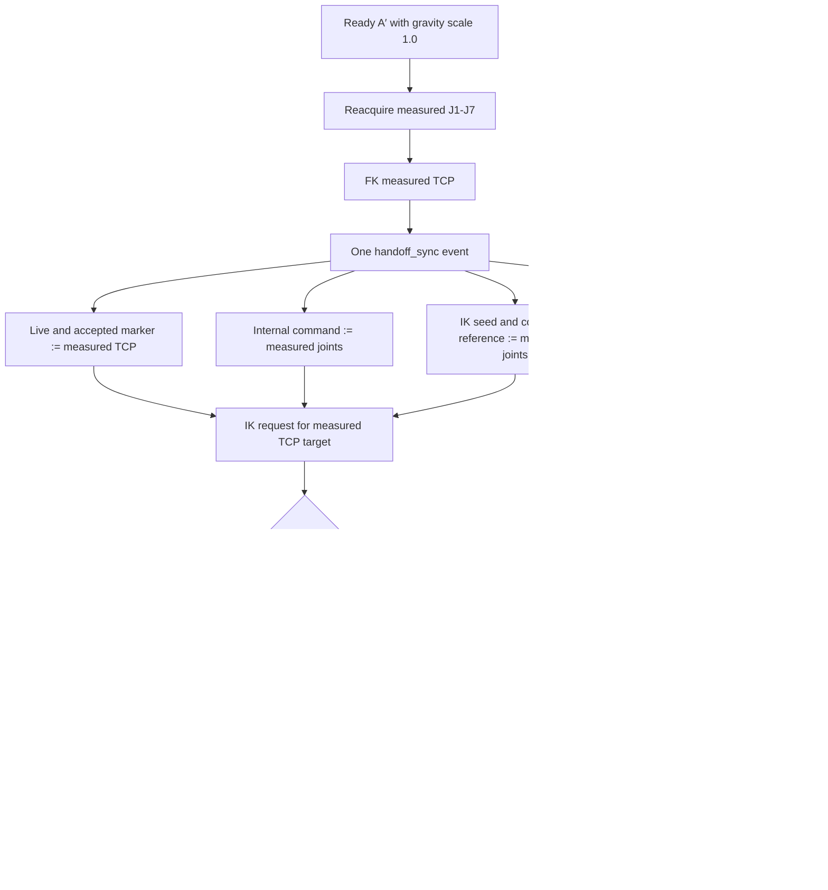

# Measured-state resynchronized handoff

```mermaid
flowchart TD
    A[Ready A′ with gravity scale 1.0] --> B[Reacquire measured J1-J7]
    B --> C[FK measured TCP]
    C --> D[One handoff_sync event]
    D --> E[Live and accepted marker := measured TCP]
    D --> F[Internal command := measured joints]
    D --> G[IK seed and continuity reference := measured joints]
    D --> H[Profile origin := measured TCP]
    E --> I[IK request for measured TCP target]
    F --> I
    G --> I
    I --> J{Existing 0.30 rad continuity gate}
    J -->|accepted continuous solution| K[Bounded convergence gate]
    J -->|rejected| X[Partial JSON and safe hold]
    K -->|stable window| L[Deterministic profile]
    K -->|5 s timeout| X
```

IK target 관절값을 measured joints로 강제하지 않는다. measured TCP를 목표로 IK를
다시 풀고 기존 continuity 기준으로 연속 해만 승인한다.
