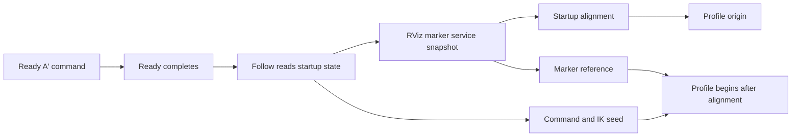

# Existing Ready → Follow handoff

기존 흐름은 Ready 종료 후 measured joint/TCP, marker, command와 IK continuity
reference를 하나의 명시적 handoff event로 기록하지 않았다. 따라서 stale marker나
startup 과도가 전체 성능 통계에 섞일 수 있었다.
