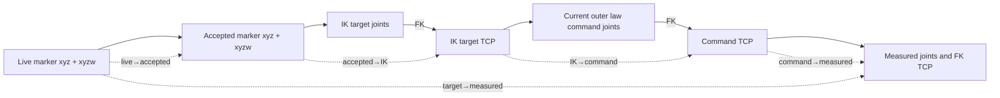
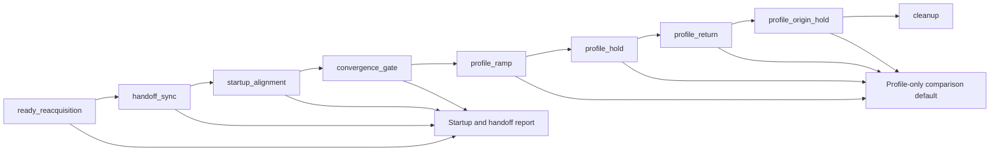
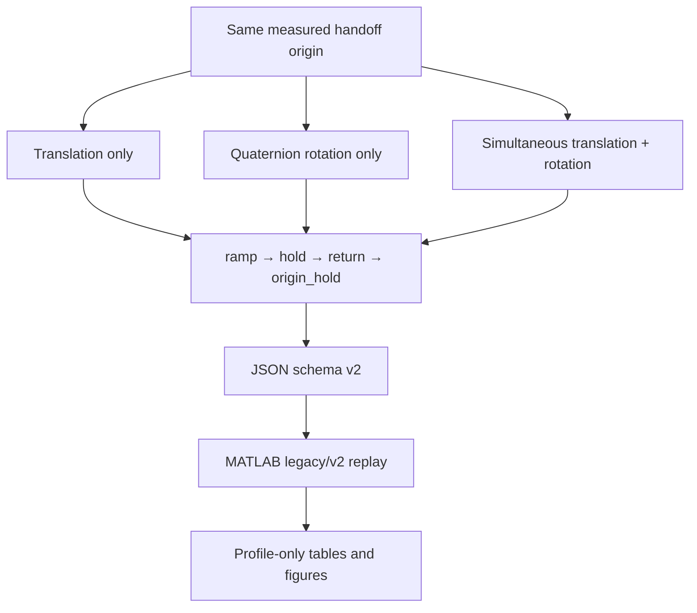

# Measurement and validation pipeline

## Pose layers

```mermaid
flowchart LR
    L[Live marker xyz + xyzw] --> A[Accepted marker xyz + xyzw]
    A --> I[IK target joints]
    I -->|FK| IT[IK target TCP]
    IT --> C[Current outer law command joints]
    C -->|FK| CT[Command TCP]
    CT --> M[Measured joints and FK TCP]
    L -. live→accepted .-> A
    A -. accepted→IK .-> IT
    IT -. IK→command .-> CT
    CT -. command→measured .-> M
    L -. target→measured .-> M
```

모든 orientation edge는 `R_measuredᵀ R_target`의 회전각으로 평가한다.

## Startup/profile statistics separation

```mermaid
flowchart LR
    R[ready_reacquisition] --> H[handoff_sync]
    H --> A[startup_alignment]
    A --> G[convergence_gate]
    G --> P1[profile_ramp]
    P1 --> P2[profile_hold]
    P2 --> P3[profile_return]
    P3 --> P4[profile_origin_hold]
    P4 --> C[cleanup]
    R & H & A & G --> S[Startup and handoff report]
    P1 & P2 & P3 & P4 --> P[Profile-only comparison default]
```

## Three-profile verification

```mermaid
flowchart TD
    O[Same measured handoff origin] --> T[Translation only]
    O --> R[Quaternion rotation only]
    O --> B[Simultaneous translation + rotation]
    T --> PH[ramp → hold → return → origin_hold]
    R --> PH
    B --> PH
    PH --> J[JSON schema v2]
    J --> M[MATLAB legacy/v2 replay]
    M --> X[Profile-only tables and figures]
```
